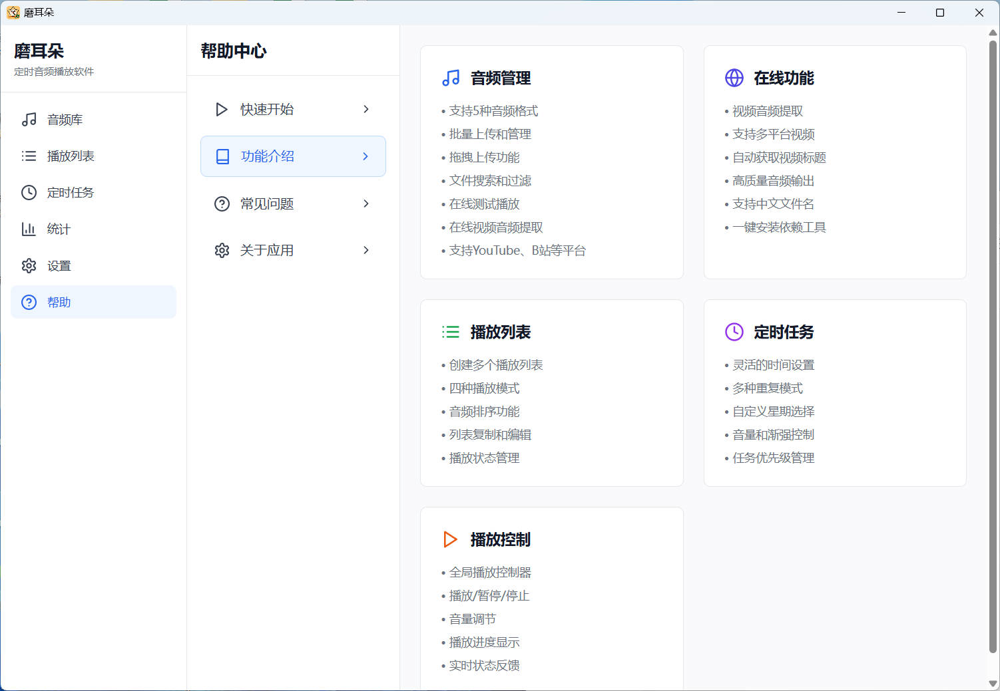
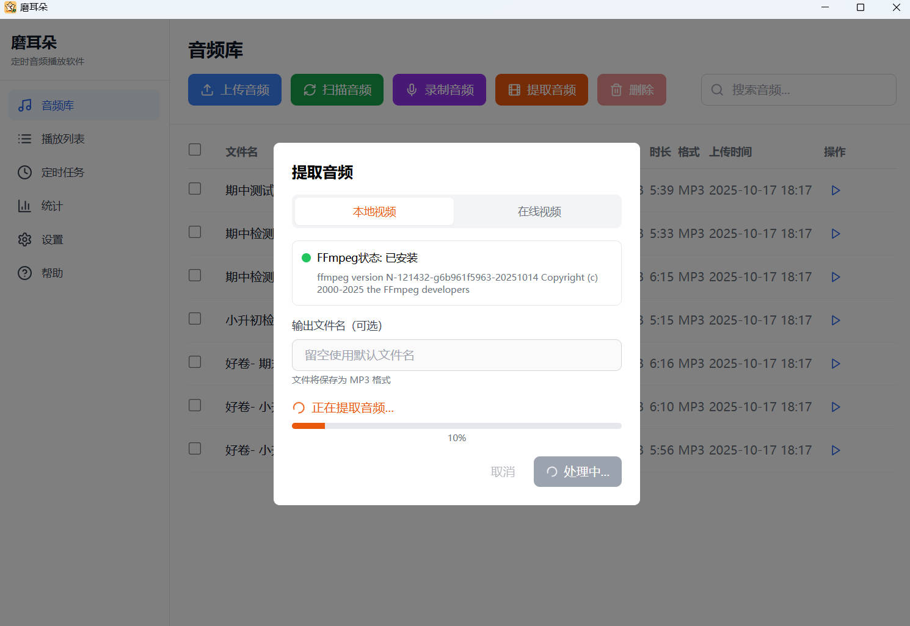
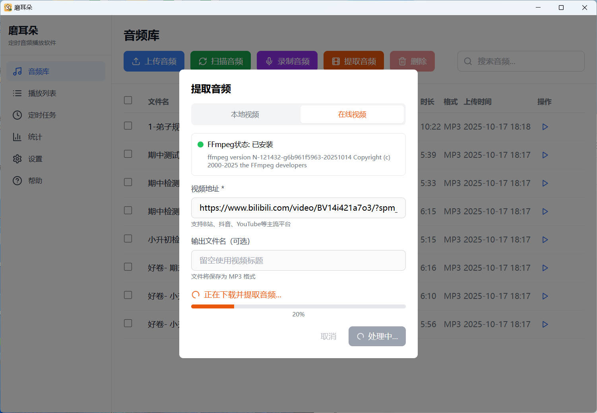
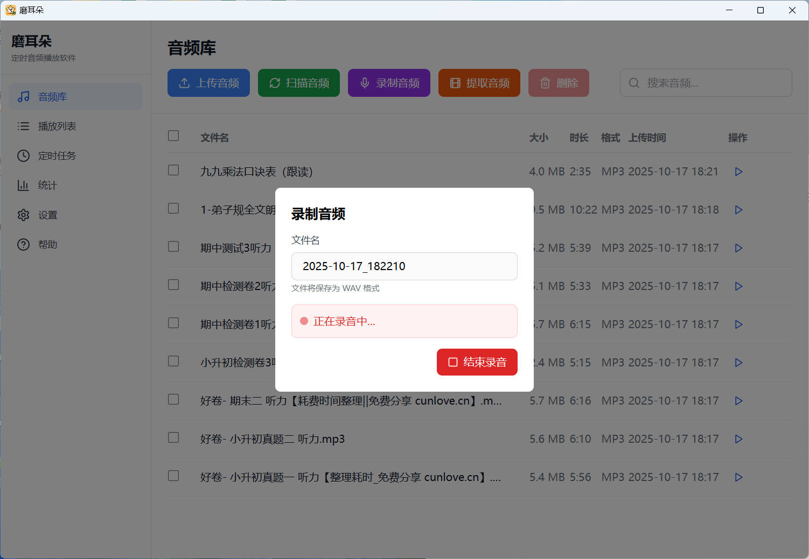
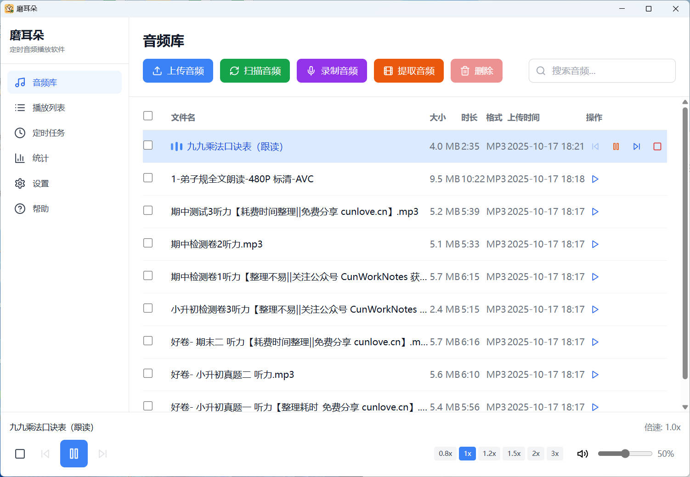
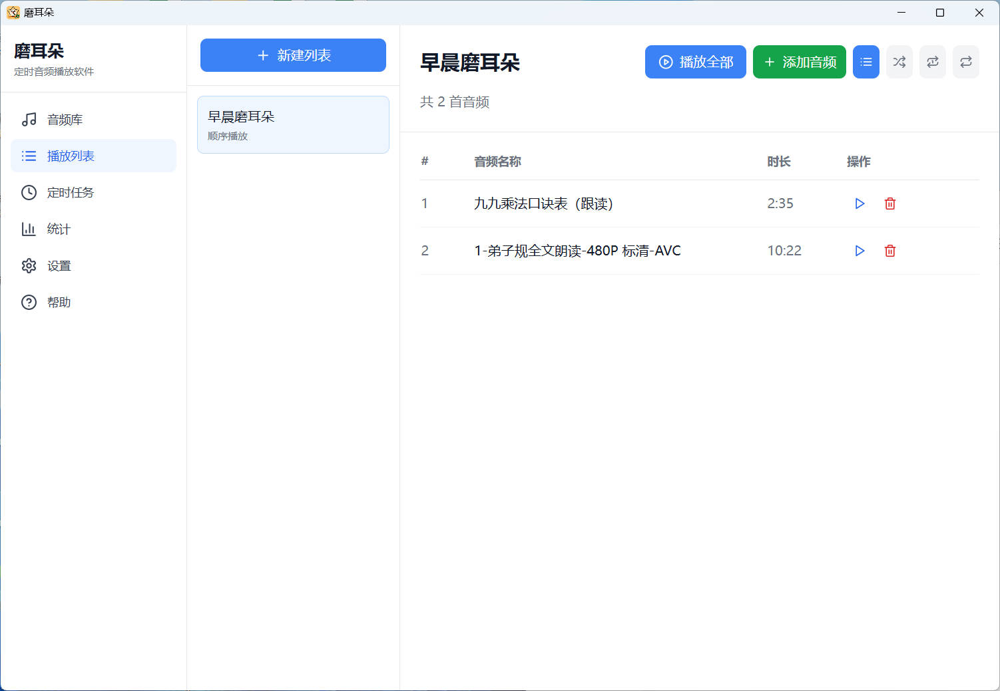
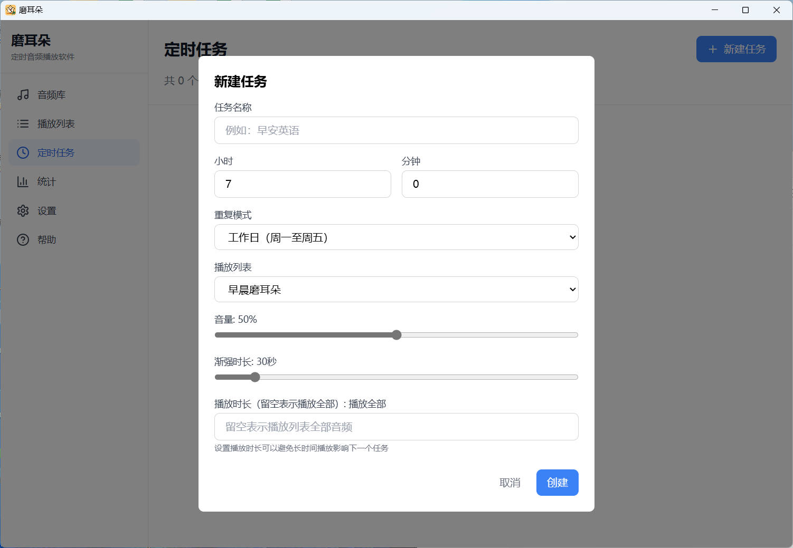

# 磨耳朵 - 开源免费跨平台定时音频播放软件

## 项目简介

磨耳朵是一个基于 Tauri 框架开发的跨平台桌面应用程序，提供灵活的定时音频播放功能。通过定时播放用户自定义的音频内容，适用于多种场景：

- **个人闹钟** - 设置定时播放音乐、语音提醒等
- **语言学习** - 家长为孩子设置定时播放外语音频来"磨耳朵"，帮助记忆和培养语感
- **知识学习** - 定时播放课程、有声读物、学习材料等
- **习惯养成** - 通过定时音频提醒帮助建立良好的作息习惯

## 应用截图

### 功能介绍


### 音频库管理




### 播放控制


### 播放列表


### 定时任务


## 核心功能

### 音频文件管理
- 支持多种音频格式（MP3、WAV、OGG、FLAC、M4A）
- 在线视频音频提取（支持 YouTube、Bilibili 等主流平台）
- 本地视频音频提取
- 直接录制音频
- 文件搜索和批量管理
- 在线测试播放
- 自动识别文件大小和时长

### 播放列表管理
- 创建多个播放列表
- 灵活的播放模式：
  - 顺序播放
  - 随机播放
  - 单曲循环
  - 列表循环

### 定时任务系统
- 精确的时间控制（时:分）
- 多样的重复模式：
  - 每天
  - 工作日（周一至周五）
  - 周末（周六、周日）
  - 自定义星期选择
  - 仅一次
- 音量独立控制
- 渐强播放设置（0-300秒）
- 任务启用/禁用开关

### 音频播放
- 基于 Rodio 的高质量播放引擎
- 播放/暂停/停止控制
- 实时音量调节
- 多格式音频支持

## 待开发功能

- [ ] 播放列表拖拽排序
- [ ] 播放列表快速编辑
- [ ] 文字转语音（TTS）功能
- [ ] 文字生成博客内容(接入外部供应商)
- [ ] 自动汇总最近热点并语音播放(接入外部供应商)
- [ ] Android 客户端
- [ ] iOS 客户端

## 技术栈

### 前端
- React 18 + TypeScript
- Tailwind CSS（样式）
- Zustand（状态管理）
- Lucide React（图标）
- Vite（构建工具）

### 后端
- Tauri 1.5（桌面应用框架）
- Rust（后端语言）
- SQLite（本地数据库）
- Rodio（音频播放）
- Tokio（异步运行时）

## 安装与使用

### 前置要求
- Node.js 18+
- npm 10+
- Rust 1.70+
- Cargo

### 安装依赖

```bash
# 进入项目目录
cd moerduo

# 安装 npm 依赖
npm install

# Cargo 依赖会在首次构建时自动下载
```

### 开发模式运行

```bash
npm run dev              # 运行 Tauri 开发模式（推荐）
npm run dev:web          # 仅运行 Vite 开发服务器（前端预览）
```

### 构建生产版本

```bash
npm run build            # 构建生产版本的 Tauri 应用
npm run build:web        # 仅构建前端
```

## 项目结构

```
moerduo/
├── src/                      # 前端源代码
│   ├── pages/               # 页面组件
│   │   ├── AudioLibrary.tsx # 音频库管理
│   │   ├── Playlists.tsx    # 播放列表管理
│   │   ├── Tasks.tsx        # 定时任务管理
│   │   ├── Statistics.tsx   # 使用统计
│   │   ├── Settings.tsx     # 应用设置
│   │   └── Help.tsx         # 帮助文档
│   ├── components/          # 可复用组件
│   ├── contexts/            # React 上下文
│   ├── hooks/               # 自定义 Hooks
│   ├── App.tsx              # 主应用组件
│   └── main.tsx             # 入口文件
├── src-tauri/               # 后端源代码
│   └── src/
│       ├── main.rs          # 程序入口
│       ├── db.rs            # 数据库初始化
│       ├── audio.rs         # 音频文件管理
│       ├── player.rs        # 音频播放引擎
│       ├── playlist.rs      # 播放列表管理
│       ├── task.rs          # 定时任务管理
│       ├── scheduler.rs     # 任务调度器
│       ├── stats.rs         # 统计功能
│       └── settings.rs      # 设置管理
├── tools/                   # 内置工具（FFmpeg、yt-dlp）
├── screenshot/              # 应用截图
├── package.json             # 前端依赖配置
├── Cargo.toml               # 后端依赖配置
└── README.md                # 本文件
```

## 数据存储

应用使用 SQLite 数据库存储所有数据，包括：

- **audio_files** - 音频文件元数据和播放统计
- **playlists** - 播放列表配置
- **playlist_items** - 播放列表与音频文件的关联
- **scheduled_tasks** - 定时任务配置
- **execution_history** - 任务执行历史记录
- **app_settings** - 应用设置

音频文件存储在应用数据目录的 `audio/` 文件夹中，使用 UUID 命名以避免文件名冲突。

## 在线视频音频提取

应用内置 FFmpeg 和 yt-dlp 工具，支持从以下平台提取音频：

- YouTube
- Bilibili
- 其他主流视频平台

**注意：** 工具文件（`tools/` 目录）不包含在 Git 仓库中。首次构建时，应用会自动下载并安装所需工具。

## 常见问题

### 如何添加音频文件？
1. 进入"音频库"页面
2. 点击"上传音频"按钮选择本地文件
3. 或点击"在线视频"按钮输入视频链接提取音频
4. 或点击"录制音频"按钮直接录制

### 如何创建定时任务？
1. 进入"定时任务"页面
2. 点击"新建任务"
3. 设置触发时间、重复模式、播放列表和音量
4. 保存并启用任务

### 如何自定义播放模式？
在"播放列表"页面，每个列表都可以独立设置播放模式（顺序/随机/单曲循环/列表循环）。

## 贡献指南

欢迎贡献代码、报告问题或提出建议！

1. Fork 本仓库
2. 创建你的特性分支 (`git checkout -b feature/AmazingFeature`)
3. 提交你的更改 (`git commit -m 'Add some AmazingFeature'`)
4. 推送到分支 (`git push origin feature/AmazingFeature`)
5. 提交 Pull Request

## 许可证

本项目采用 [MIT License](LICENSE) 开源协议。
